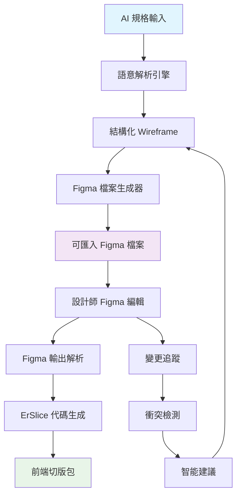

# 雙向 Figma 生態系統研究
## 從 AI Wireframe 到 Figma，再到代碼的完整工作流程

---

## 🎯 研究目標

建立一個革命性的雙向設計工具生態系統，既能**匯入 Figma 輸出**（已完成），也能**生成 Figma 輸入**，實現從 AI 生成的 Wireframe 到最終代碼的無縫工作流程。

### 核心概念
```
AI 規格描述 → AI Wireframe → Figma 輸入格式 → Figma 設計 → Figma 輸出 → ErSlice 代碼生成
     ↑______________________________________________|
                    雙向反饋循環
```

---

## 📋 問題定義

### 🔴 當前痛點
1. **AI 生成斷點**：AI 產生的 wireframe 無法直接匯入 Figma
2. **工作流程割裂**：設計師需要手動重建 AI 概念
3. **迭代效率低**：修改需要重複整個流程
4. **標準缺失**：缺乏 AI → Figma 的標準化格式

### 🎯 解決願景
- **無縫銜接**：AI wireframe 直接生成可匯入的 Figma 檔案
- **雙向同步**：設計變更可回饋到規格和代碼
- **標準化流程**：建立業界標準的轉換格式
- **智能優化**：自動優化設計以符合開發最佳實踐

---

## 🔍 參考研究分析

### 1. 網頁到設計工具轉換技術
**核心概念學習**：
- **網頁到設計轉換**：從現有網頁提取設計元素
- **自動化解析**：HTML/CSS 結構自動轉換為 Figma 圖層
- **多設備視窗支援**：響應式設計的自動適配

**技術亮點**：
```javascript
// 概念示例：HTML 元素到 Figma 節點的映射
const htmlToFigmaMapping = {
  div: 'FRAME',
  img: 'IMAGE', 
  text: 'TEXT',
  button: 'COMPONENT'
}
```

### 2. html.to.design Plugin
**核心功能學習**：
- **8百萬頁面匯入經驗**：大規模轉換的成熟度
- **複雜設計元素支援**：漸變、字體、佈局保真度
- **自動樣式生成**：CSS 到 Figma 樣式的智能轉換

**轉換流程**：
```
URL輸入 → 網頁解析 → 設計提取 → Figma節點生成 → 可編輯設計
```

---

## 🏗️ 技術架構設計

### Phase 1: AI Wireframe 到 Figma 輸入格式轉換器

#### 1.1 AI Wireframe 解析引擎
```typescript
interface AIWireframe {
  layout: LayoutStructure
  components: ComponentDefinition[]
  interactions: InteractionFlow[]
  responsive: ResponsiveSpecs
  designSystem: DesignTokens
}

interface LayoutStructure {
  type: 'grid' | 'flexbox' | 'absolute'
  containers: LayoutContainer[]
  hierarchy: ElementHierarchy
}
```

#### 1.2 Figma 檔案生成器
```typescript
class FigmaFileGenerator {
  // 將 AI wireframe 轉換為 Figma JSON 格式
  generateFigmaFile(wireframe: AIWireframe): FigmaFile
  
  // 智能佈局優化
  optimizeForFigma(layout: LayoutStructure): FigmaLayout
  
  // 設計系統對應
  mapDesignTokens(tokens: DesignTokens): FigmaStyles
}
```

### Phase 2: 雙向同步系統

#### 2.1 變更追蹤引擎
```typescript
interface ChangeTracker {
  trackDesignChanges(before: FigmaFile, after: FigmaFile): DesignChange[]
  syncToWireframe(changes: DesignChange[]): AIWireframe
  updateCodeGeneration(changes: DesignChange[]): CodeGenerationPlan
}
```

#### 2.2 智能衝突解決
```typescript
class ConflictResolver {
  // 處理設計與代碼生成的衝突
  resolveDesignCodeConflicts(designChanges: DesignChange[], codeConstraints: CodeConstraint[]): Resolution[]
  
  // 提供智能建議
  suggestOptimizations(conflicts: Conflict[]): Suggestion[]
}
```

---

## 🧠 核心算法設計

### 1. AI Wireframe 智能解析算法

#### 語意理解引擎
```typescript
class SemanticParser {
  // 從 AI 描述中提取結構化信息
  parseAIDescription(description: string): StructuredSpec {
    return {
      layout: this.extractLayoutInfo(description),
      components: this.identifyComponents(description),
      interactions: this.mapInteractions(description),
      businessLogic: this.extractBusinessRules(description)
    }
  }
  
  // 智能組件識別
  identifyComponents(description: string): ComponentSpec[] {
    // 使用 NLP 識別常見 UI 模式
    // 映射到標準組件庫
  }
}
```

### 2. Figma 節點生成算法

#### 層級結構建構器
```typescript
class FigmaNodeBuilder {
  // 將平面 wireframe 轉換為 Figma 層級結構
  buildNodeHierarchy(wireframe: AIWireframe): FigmaNode {
    return {
      type: 'DOCUMENT',
      children: this.createPages(wireframe.layout),
      styles: this.generateStyles(wireframe.designSystem)
    }
  }
  
  // 智能命名系統
  generateSmartNames(components: ComponentSpec[]): NameMapping {
    // 使用我們現有的四維命名系統
    // Device/Module/Page/State
  }
}
```

### 3. 響應式轉換算法

#### 多設備適配引擎
```typescript
class ResponsiveConverter {
  // 從單一 wireframe 生成多設備版本
  generateResponsiveVariants(wireframe: AIWireframe): ResponsiveSet {
    return {
      desktop: this.adaptForDesktop(wireframe),
      tablet: this.adaptForTablet(wireframe),
      mobile: this.adaptForMobile(wireframe)
    }
  }
  
  // 智能佈局調整
  adaptLayout(layout: LayoutStructure, targetDevice: DeviceType): LayoutStructure {
    // 基於設計最佳實踐的自動調整
  }
}
```

---

## 📊 資料格式規範

### 1. AI Wireframe 標準格式 (AWF - AI Wireframe Format)

```json
{
  "version": "1.0",
  "metadata": {
    "generated_by": "AI_SYSTEM",
    "timestamp": "2024-XX-XX",
    "spec_source": "natural_language_description"
  },
  "design_intent": {
    "business_goals": ["goal1", "goal2"],
    "user_personas": ["persona1", "persona2"],
    "key_features": ["feature1", "feature2"]
  },
  "layout": {
    "structure_type": "grid_based",
    "main_sections": [
      {
        "name": "header",
        "purpose": "navigation_and_branding",
        "components": ["logo", "nav_menu", "user_actions"]
      }
    ]
  },
  "components": [
    {
      "id": "comp_001",
      "type": "navigation",
      "semantic_role": "primary_navigation",
      "properties": {
        "items": ["home", "products", "about", "contact"],
        "style": "horizontal_bar",
        "responsive_behavior": "collapse_to_hamburger"
      }
    }
  ],
  "interactions": [
    {
      "trigger": "click_nav_item",
      "action": "navigate_to_page",
      "target": "page_url"
    }
  ],
  "responsive_specs": {
    "breakpoints": [375, 768, 1024, 1440],
    "adaptations": {
      "mobile": {
        "navigation": "hamburger_menu",
        "layout": "single_column"
      }
    }
  }
}
```

### 2. Figma 輸入格式 (FIF - Figma Input Format)

```json
{
  "document": {
    "id": "generated_doc_id",
    "name": "AI Generated Design",
    "children": [
      {
        "id": "page_id",
        "name": "Desktop - Main Flow",
        "type": "CANVAS",
        "children": [
          {
            "id": "frame_id",
            "name": "Header_Navigation_Default",
            "type": "FRAME",
            "constraints": {
              "horizontal": "LEFT_RIGHT",
              "vertical": "TOP"
            },
            "fills": [{"type": "SOLID", "color": {"r": 1, "g": 1, "b": 1}}]
          }
        ]
      }
    ]
  },
  "styles": {
    "text_styles": {},
    "fill_styles": {},
    "effect_styles": {}
  },
  "component_sets": {}
}
```

---

## 🔄 工作流程設計

### 完整雙向工作流程



### 具體實施步驟

#### Step 1: AI 輸入處理
```typescript
// 1. 自然語言規格解析
const spec = await parseNaturalLanguage(userInput)

// 2. 結構化 wireframe 生成
const wireframe = await generateWireframe(spec)

// 3. 設計系統對應
const designTokens = await mapToDesignSystem(wireframe)
```

#### Step 2: Figma 檔案生成
```typescript
// 1. 節點結構建構
const figmaNodes = await buildFigmaStructure(wireframe)

// 2. 樣式和組件生成
const figmaStyles = await generateFigmaStyles(designTokens)

// 3. 完整檔案打包
const figmaFile = await packageFigmaFile(figmaNodes, figmaStyles)
```

#### Step 3: 雙向同步
```typescript
// 1. 變更監聽
const changes = await trackFigmaChanges(originalFile, modifiedFile)

// 2. 回饋處理
const updatedWireframe = await syncChangesToWireframe(changes)

// 3. 代碼生成更新
const newCodePlan = await updateCodeGeneration(updatedWireframe)
```

---

## 🧪 技術挑戰與解決方案

### 挑戰 1: AI 描述的歧義性
**問題**：自然語言描述往往模糊不清
**解決方案**：
- 建立標準化描述模板
- 使用互動式澄清對話
- 實施信心度評分系統

### 挑戰 2: Figma API 限制
**問題**：Figma 插件 API 有功能限制
**解決方案**：
- 研究 Figma REST API 的完整功能
- 開發混合方案（插件 + REST API）
- 建立中間檔案格式來規避限制

### 挑戰 3: 設計品質保證
**問題**：自動生成的設計可能不符合設計原則
**解決方案**：
- 整合設計系統最佳實踐
- 實施自動設計審查
- 提供設計師友善的調整介面

### 挑戰 4: 複雜互動邏輯
**問題**：AI 難以理解複雜的使用者互動
**解決方案**：
- 建立互動模式庫
- 使用有限狀態機描述互動
- 提供視覺化互動編輯器

---

## 📈 實施路線圖

### Phase 1: 基礎轉換引擎 (4-6 週)
- [ ] AI Wireframe 解析器開發
- [ ] 基礎 Figma 檔案生成器
- [ ] 簡單佈局轉換支援
- [ ] 核心設計令牌對應

### Phase 2: 進階功能開發 (6-8 週)
- [ ] 響應式設計轉換
- [ ] 複雜組件支援
- [ ] 互動邏輯映射
- [ ] 設計系統整合

### Phase 3: 雙向同步系統 (4-6 週)
- [ ] 變更追蹤引擎
- [ ] 衝突檢測與解決
- [ ] 智能建議系統
- [ ] 回饋循環機制

### Phase 4: 整合與優化 (3-4 週)
- [ ] 與現有 ErSlice 系統整合
- [ ] 效能優化
- [ ] 使用者體驗改善
- [ ] 文檔和測試完善

---

## 🎖️ 創新亮點

### 1. 業界首創雙向轉換
- **獨特性**：市場上首個支援 AI → Figma → Code 完整流程的工具
- **價值**：革命性地改變設計到開發的工作模式

### 2. 智能四維命名系統
- **技術優勢**：結合我們現有的 Device/Module/Page/State 解析系統
- **實用性**：確保生成的設計檔案具有清晰的組織結構

### 3. 設計品質自動保證
- **自動化**：內建設計最佳實踐檢查
- **智能化**：基於設計系統的自動優化建議

### 4. 無縫生態系統整合
- **完整性**：從概念到代碼的端到端解決方案
- **擴展性**：可輕鬆整合更多 AI 工具和設計平台

---

## 🔬 概念驗證 (PoC) 規劃

### MVP 功能範圍
1. **基礎 AI 描述解析**：支援簡單的佈局描述
2. **基本 Figma 檔案生成**：生成可匯入的基礎設計
3. **核心組件轉換**：支援 5-10 種常見 UI 組件
4. **簡單響應式**：支援 3 種設備尺寸

### 測試場景
```
輸入：「創建一個電商產品列表頁，包含搜尋欄、篩選器、產品卡片網格，支援手機和桌面版本」

期望輸出：
1. 結構化的 AI Wireframe JSON
2. 可匯入 Figma 的設計檔案
3. 包含響應式變體的完整設計
4. 符合命名規範的圖層結構
```

---

## 📚 延伸研究方向

### 1. AI 模型整合研究
- **多模態 AI**：結合文字、圖像、草圖輸入
- **專業 AI 模型**：針對 UX/UI 設計訓練的專用模型
- **即時協作 AI**：在設計過程中提供即時建議

### 2. 設計系統進化研究
- **動態設計系統**：根據專案需求自動調整的設計系統
- **跨平台設計系統**：統一 Web、Mobile、Desktop 的設計語言
- **AI 驅動設計系統**：基於使用資料自動優化的設計系統

### 3. 協作流程研究
- **多角色協作**：PM、設計師、開發者的無縫協作流程
- **版本控制系統**：設計檔案的類 Git 版本管理
- **自動化測試**：設計一致性和可用性的自動化檢測

---

## 🎯 成功指標

### 技術指標
- **轉換準確度**：AI → Figma 轉換準確度 > 85%
- **設計品質**：自動生成設計的可用性評分 > 4/5
- **處理速度**：複雜佈局轉換時間 < 30 秒
- **相容性**：支援 95% 的常見 UI 模式

### 業務指標
- **工作流程效率**：設計到開發時間縮短 60%+
- **設計一致性**：跨專案設計系統使用率 > 90%
- **開發者滿意度**：生成代碼的可用性 > 4.5/5
- **市場接受度**：月活躍使用者數成長 > 50%

---

## 💡 結論

這個雙向 Figma 生態系統研究代表了設計工具發展的下一個重大突破。透過結合：

- **AI 的創意生成能力**
- **Figma 的協作設計平台**  
- **ErSlice 的智能代碼生成**

我們將創造一個真正革命性的設計到開發工作流程，讓創意從概念到實現的過程變得前所未有的高效和精確。

這不僅是技術創新，更是對整個設計開發行業工作模式的重新定義。🚀

---

*此研究建基於 MIT 授權的開源專案學習，完全採用原創實現方式，不複製任何現有代碼或文檔。*