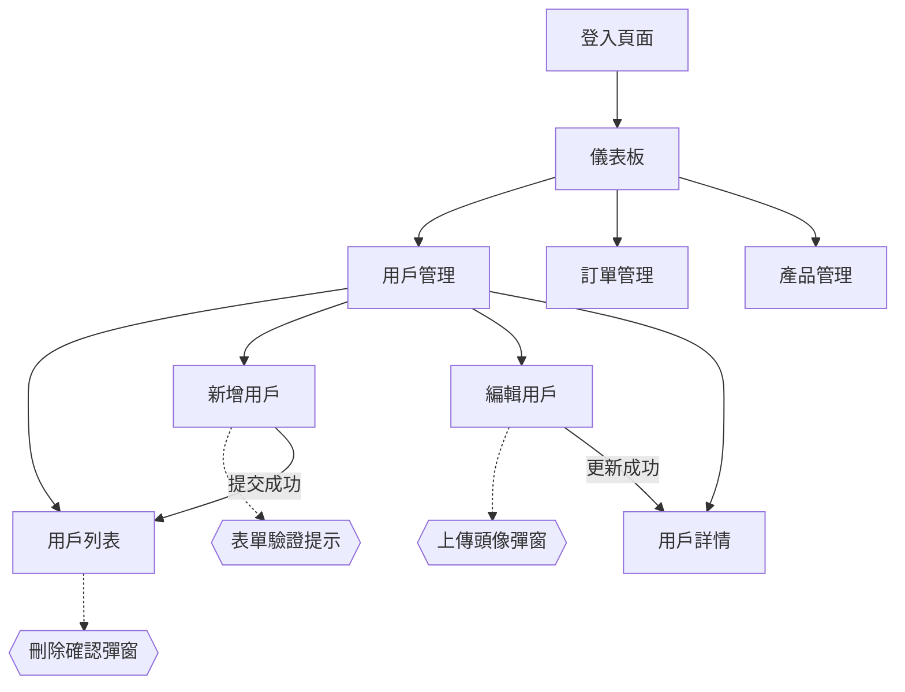

# ErSlice 超詳細站點圖規格文檔

## 目標：生成 RD/AI 友善的前端切版組合包

### 1. Mermaid 站點圖詳細度要求

#### 基本頁面關係


#### 詳細互動說明
每個 Mermaid 圖必須包含：

1. **頁面層級關係**
   - 主頁面 (方形節點)
   - 子頁面 (圓角方形)
   - 彈窗 (雙花括號)
   - 狀態變化 (菱形)

2. **互動類型**
   - 導航 (實線箭頭)
   - 彈窗觸發 (虛線箭頭)
   - 狀態轉換 (粗線箭頭)
   - 條件分支 (標記文字)

3. **設備差異標記**
   - Desktop: D_頁面名稱
   - Tablet: T_頁面名稱  
   - Mobile: M_頁面名稱

### 2. 多螢幕資產結構

```
screenshots/
├── desktop-1920x1080/
│   ├── 01-login.png
│   ├── 02-dashboard.png
│   ├── 03-user-list.png
│   ├── 04-user-form.png
│   └── modals/
│       ├── delete-confirm.png
│       └── upload-avatar.png
├── tablet-768x1024/
│   ├── 01-login.png
│   ├── 02-dashboard-sidebar-collapsed.png
│   └── ...
└── mobile-375x667/
    ├── 01-login.png
    ├── 02-dashboard-hamburger.png
    └── ...
```

### 3. 互動文檔化格式

#### 彈窗互動說明 (interactions/modals/)
```markdown
# 刪除確認彈窗

## 觸發條件
- 用戶列表頁面點擊刪除按鈕

## 彈窗內容
- 標題：確認刪除
- 訊息：確定要刪除用戶「張三」嗎？此操作無法復原
- 按鈕：取消 / 確定刪除

## 互動行為
- 點擊取消：關閉彈窗
- 點擊確定：執行刪除 → 顯示成功提示 → 刷新列表

## RWD 差異
- Desktop: 彈窗居中，寬度 400px
- Mobile: 彈窗佔滿螢幕，底部滑入
```

#### 狀態變化說明 (interactions/states/)
```markdown
# 表單狀態變化

## 空白狀態
- 所有欄位為空
- 提交按鈕禁用
- 無錯誤提示

## 填寫中狀態  
- 即時驗證
- 錯誤提示顯示
- 提交按鈕狀態變化

## 提交中狀態
- 按鈕顯示 Loading
- 禁用所有輸入
- 顯示進度指示

## 成功/失敗狀態
- 成功：綠色提示 + 頁面跳轉
- 失敗：紅色提示 + 保持在頁面
```

### 4. 程式碼資產結構

#### HTML 結構 (code/html/)
```html
<!-- user-list.html -->
<div class="user-management-container">
  <header class="page-header">
    <h1>用戶管理</h1>
    <button class="btn-primary" data-action="add-user">新增用戶</button>
  </header>
  
  <div class="user-list-table">
    <!-- 表格內容 -->
  </div>
  
  <!-- 彈窗模板 -->
  <div class="modal-template" id="delete-confirm-modal">
    <!-- 彈窗內容 -->
  </div>
</div>
```

#### CSS 樣式 (code/css/)
```css
/* user-list.css */

/* Desktop 樣式 */
@media (min-width: 1024px) {
  .user-management-container {
    padding: 2rem;
    max-width: 1200px;
  }
}

/* Tablet 樣式 */  
@media (min-width: 768px) and (max-width: 1023px) {
  .user-management-container {
    padding: 1rem;
  }
}

/* Mobile 樣式 */
@media (max-width: 767px) {
  .user-management-container {
    padding: 0.5rem;
  }
  
  .page-header {
    flex-direction: column;
    gap: 1rem;
  }
}
```

#### 組件說明 (code/components/)
```markdown
# UserList 組件

## Props
- users: User[] - 用戶列表資料
- onEdit: (id: string) => void - 編輯回調
- onDelete: (id: string) => void - 刪除回調

## 狀態
- loading: boolean - 載入狀態
- selectedUsers: string[] - 選中的用戶 ID

## 互動行為
1. 點擊編輯 → 觸發 onEdit 回調
2. 點擊刪除 → 顯示確認彈窗
3. 批量選擇 → 啟用批量操作按鈕

## RWD 適配
- Desktop: 顯示完整表格
- Tablet: 隱藏次要欄位
- Mobile: 改為卡片式佈局
```

### 5. 最終輸出包格式

#### 專案結構
```
{project-name}-frontend-slice-package/
├── README.md                    # 開發總指南
├── sitemap-overview.mmd         # 整體站點圖
├── sitemap-detailed.mmd         # 詳細互動圖
├── 
├── assets/
│   ├── screenshots/
│   │   ├── desktop/
│   │   ├── tablet/
│   │   └── mobile/
│   └── mockups/                 # 設計稿原檔
│
├── code/
│   ├── html/
│   │   ├── pages/               # 頁面 HTML
│   │   └── components/          # 組件 HTML
│   ├── css/
│   │   ├── global.css          # 全域樣式
│   │   ├── responsive.css      # RWD 樣式
│   │   └── components/         # 組件樣式
│   └── js/
│       └── interactions.js     # 互動邏輯說明
│
├── documentation/
│   ├── pages/                  # 頁面說明文檔
│   ├── components/             # 組件說明文檔
│   ├── interactions/           # 互動說明文檔
│   └── style-guide.md          # 樣式指南
│
└── ai-development-guide/
    ├── development-steps.md    # 開發步驟指南
    ├── component-specs.md      # 組件規格說明
    └── testing-checklist.md    # 測試檢查清單
```

#### README.md 範本
```markdown
# {專案名稱} 前端切版組合包

## 快速開始
1. 查看 `sitemap-overview.mmd` 了解整體架構
2. 參考 `assets/screenshots/` 了解視覺設計
3. 使用 `code/` 資料夾中的 HTML/CSS 開始開發
4. 查看 `documentation/` 了解詳細規格

## 螢幕適配
- Desktop: 1920x1080+ (主要開發基準)
- Tablet: 768x1024 (iPad 標準)
- Mobile: 375x667 (iPhone 標準)

## 關鍵互動
- 查看 `documentation/interactions/` 了解彈窗和狀態變化
- 參考 `code/js/interactions.js` 了解互動邏輯

## AI 開發指南
- 閱讀 `ai-development-guide/` 獲得 AI 友善的開發指導
```

### 6. ErSlice 系統改進建議

基於這個目標，ErSlice 需要強化：

1. **Mermaid 生成器增強**
   - 支援互動層級的詳細標記
   - 自動生成彈窗和狀態轉換
   - 多設備差異標記

2. **截圖管理系統**
   - 多解析度截圖上傳
   - 自動分類和命名
   - 互動狀態截圖管理

3. **程式碼生成器**
   - HTML 結構自動生成
   - RWD CSS 樣板生成
   - 組件規格文檔生成

4. **文檔生成系統**
   - 互動說明自動生成
   - 開發指南模板
   - AI 友善的規格文檔

這樣的輸出包會讓任何 RD 或 AI 都能快速理解並開始前端開發工作！