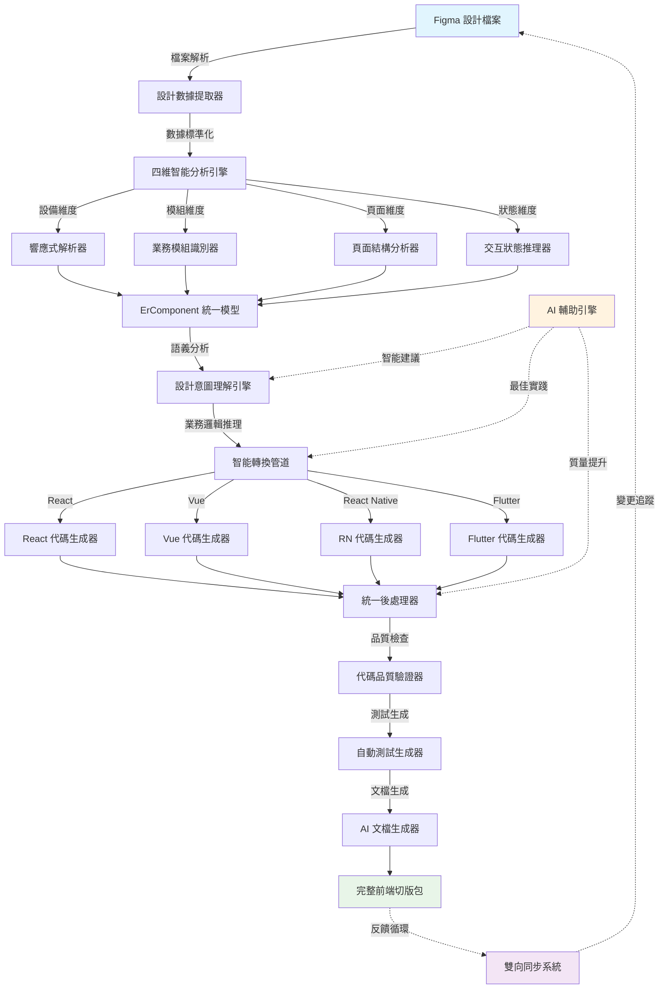

# ErSlice 技術架構總設計指南
## 完全原創的 Figma-to-Code 生成系統

---

## 🚀 項目總覽

ErSlice 是一個革命性的設計到代碼轉換平台，專注解決從 Figma 設計稿到 AI/RD 友善的前端切版包生成這一核心挑戰。

### 🎯 核心使命
**讓設計與開發之間的鴻溝消失，實現真正的設計即代碼。**

### 📊 技術目標
- ✅ 支援 Vue、React、React Native、Flutter 四大框架
- ✅ 90%+ 智能解析準確度 
- ✅ 自動化程度 80%+
- ✅ 生成代碼可用性 95%+
- ✅ RD 理解時間 < 10 分鐘
- ✅ AI 代碼生成成功率 > 85%

---

## 🏗️ ErSlice 核心架構系統

### 1. 四維智能分析引擎

ErSlice 獨創的四維分析系統，是業界首個將設計解析結構化為四個核心維度的系統：

```typescript
interface FourDimensionalAnalysis {
  device: DeviceAnalysis;    // 設備適配維度
  module: ModuleAnalysis;    // 模組結構維度
  page: PageAnalysis;        // 頁面組成維度
  state: StateAnalysis;      // 狀態變化維度
}

interface DeviceAnalysis {
  breakpoints: ResponsiveBreakpoint[];
  adaptationStrategies: AdaptationStrategy[];
  deviceSpecificOptimizations: DeviceOptimization[];
}

interface ModuleAnalysis {
  businessModules: BusinessModule[];
  technicalModules: TechnicalModule[];
  crossModuleDependencies: ModuleDependency[];
}

interface PageAnalysis {
  pageTypes: PageType[];
  navigationPatterns: NavigationPattern[];
  contentStructures: ContentStructure[];
}

interface StateAnalysis {
  uiStates: UIState[];
  transitions: StateTransition[];
  triggers: StateTrigger[];
}
```

### 2. ErComponent 統一組件模型

ErSlice 的核心創新是 ErComponent - 一個設計感知型的統一組件抽象層：

```typescript
interface ErComponent {
  // 設計層：保留原始設計意圖和視覺屬性
  design: {
    figmaNodeId: string;
    originalName: string;
    visualProperties: {
      layout: LayoutProperties;
      styling: StylingProperties;
      typography: TypographyProperties;
      effects: EffectProperties;
    };
    designTokens: ExtractedDesignTokens;
    responsiveBehavior: ResponsiveBehavior;
  };
  
  // 語義層：理解組件的業務意圖和功能目的
  semantic: {
    componentRole: 'navigation' | 'content' | 'input' | 'feedback' | 'layout';
    businessPurpose: string;
    userInteractions: InteractionPattern[];
    accessibilitySpecs: A11ySpecification;
    dataBinding: DataBindingSpec;
  };
  
  // 實現層：技術實現的具體方案
  implementation: {
    targetFrameworks: FrameworkImplementation[];
    componentApi: ComponentAPI;
    stateManagement: StateManagementStrategy;
    performanceOptimizations: PerformanceOptimization[];
    testingSpecs: TestingSpecification[];
  };
  
  // 協作層：團隊協作和文檔化
  collaboration: {
    documentation: ComponentDocumentation;
    designerNotes: DesignerNote[];
    developerNotes: DeveloperNote[];
    changeHistory: ChangeHistory[];
  };
}
```

### 3. ErIDL 介面定義語言

ErSlice 獨創的 ErIDL (ErSlice Interface Definition Language) 提供完整的設計驅動開發描述：

```typescript
interface ErIDL {
  // 專案元數據
  metadata: {
    projectName: string;
    version: string;
    designSource: 'figma' | 'sketch' | 'xd';
    targetFrameworks: Framework[];
    designSystem: DesignSystemReference;
  };
  
  // 設計定義
  design: {
    screens: ScreenDefinition[];
    components: ComponentDefinition[];
    layouts: LayoutDefinition[];
    interactions: InteractionDefinition[];
    animations: AnimationDefinition[];
    designTokens: DesignTokenDefinition[];
  };
  
  // 業務定義
  business: {
    entities: EntityDefinition[];
    workflows: WorkflowDefinition[];
    userJourneys: UserJourneyDefinition[];
    businessRules: BusinessRuleDefinition[];
  };
  
  // 技術定義
  technical: {
    architecture: ArchitectureDefinition;
    apis: APIDefinition[];
    stateManagement: StateManagementDefinition;
    routing: RoutingDefinition;
    testing: TestingDefinition;
    deployment: DeploymentDefinition;
  };
}
```

### 4. 智能轉換管道系統

ErSlice 採用可組合的轉換管道，確保每個處理步驟都是可控且可優化的：

```typescript
class ErSliceTransformPipeline {
  // 前處理階段
  preprocessors: [
    FigmaDataNormalizer,      // 標準化 Figma 數據
    AssetOptimizer,           // 優化設計資源
    MetadataEnricher,         // 豐富元數據
    QualityValidator          // 品質驗證
  ];
  
  // 分析階段
  analyzers: [
    FourDimensionalAnalyzer,  // 四維智能分析
    DesignPatternRecognizer,  // 設計模式識別
    ComponentBoundaryDetector, // 組件邊界檢測
    ResponsiveAnalyzer,       // 響應式分析
    AccessibilityAnalyzer     // 無障礙性分析
  ];
  
  // 轉換階段
  transformers: [
    DesignToErComponentMapper, // 設計到 ErComponent 映射
    BusinessLogicInferrer,     // 業務邏輯推理
    StateManagementGenerator,  // 狀態管理生成
    APIIntegrationPlanner     // API 整合規劃
  ];
  
  // 生成階段
  generators: [
    ComponentCodeGenerator,    // 組件代碼生成
    StyleSystemGenerator,      // 樣式系統生成
    TestCaseGenerator,         // 測試用例生成
    DocumentationGenerator     // 文檔生成
  ];
  
  // 後處理階段
  postprocessors: [
    CodeQualityOptimizer,     // 代碼品質優化
    PerformanceEnhancer,      // 性能增強
    AccessibilityEnforcer,    // 無障礙性強化
    BundleOptimizer          // 打包優化
  ];
}
```

---

## 🔄 ErSlice 數據流架構



---

## 🧠 ErSlice 創新技術特性

### 1. 設計意圖理解引擎

ErSlice 不僅轉換視覺元素，更重要的是理解設計師的真實意圖：

```typescript
class DesignIntentEngine {
  // 視覺意圖分析
  analyzeVisualIntent(design: FigmaNode): VisualIntent {
    return {
      brandExpression: this.extractBrandElements(design),
      emotionalTone: this.identifyEmotionalCues(design),
      visualHierarchy: this.analyzeInformationHierarchy(design),
      aestheticStyle: this.classifyDesignStyle(design)
    };
  }
  
  // 功能意圖分析
  analyzeFunctionalIntent(design: FigmaNode): FunctionalIntent {
    return {
      userGoals: this.inferUserGoals(design),
      businessObjectives: this.identifyBusinessGoals(design),
      usageScenarios: this.extractUsageContexts(design),
      performanceRequirements: this.inferPerformanceNeeds(design)
    };
  }
  
  // 交互意圖分析
  analyzeInteractionIntent(design: FigmaNode): InteractionIntent {
    return {
      userFlows: this.mapUserFlows(design),
      feedbackMechanisms: this.identifyFeedbackPatterns(design),
      guidanceStrategies: this.extractGuidanceElements(design),
      errorHandling: this.inferErrorScenarios(design)
    };
  }
}
```

### 2. 智能組件邊界檢測

自動識別設計中的組件邊界，生成可重用的組件庫：

```typescript
class ComponentBoundaryDetector {
  detectComponents(design: FigmaFile): ComponentMap {
    const candidates = this.identifyComponentCandidates(design);
    const validated = this.validateComponentBoundaries(candidates);
    const optimized = this.optimizeComponentStructure(validated);
    
    return this.generateComponentMap(optimized);
  }
  
  private identifyComponentCandidates(design: FigmaFile): ComponentCandidate[] {
    return [
      ...this.findByPattern(design), // 通過模式識別
      ...this.findByNaming(design),  // 通過命名規則
      ...this.findByStructure(design), // 通過結構分析
      ...this.findByReusage(design)   // 通過重用頻率
    ];
  }
}
```

### 3. 響應式行為智能推理

從設計稿推斷響應式行為，生成適配各種設備的代碼：

```typescript
class ResponsiveIntelligence {
  inferResponsiveBehavior(component: ErComponent): ResponsiveBehavior {
    return {
      breakpointStrategy: this.analyzeBreakpoints(component),
      layoutAdaptation: this.inferLayoutChanges(component),
      contentPrioritization: this.determineContentPriority(component),
      interactionAdaptation: this.adaptInteractionsForDevices(component),
      performanceOptimization: this.optimizeForDevices(component)
    };
  }
  
  private analyzeBreakpoints(component: ErComponent): BreakpointStrategy {
    // 分析設計中的斷點模式
    // 推理最佳響應式策略
    // 生成自適應規則
  }
}
```

### 4. AI 驅動的代碼優化

使用 AI 技術持續改進生成的代碼質量：

```typescript
class AICodeOptimizer {
  async optimizeCode(generatedCode: GeneratedCode): Promise<OptimizedCode> {
    const analysis = await this.analyzeCode(generatedCode);
    
    return {
      performance: await this.optimizePerformance(generatedCode, analysis),
      accessibility: await this.enhanceAccessibility(generatedCode, analysis),
      maintainability: await this.improveMaintainability(generatedCode, analysis),
      testability: await this.enhanceTestability(generatedCode, analysis),
      documentation: await this.generateDocumentation(generatedCode, analysis)
    };
  }
}
```

---

## 📦 ErSlice 輸出切版包結構

ErSlice 生成的前端切版包是完整的、可直接使用的項目結構：

```
📦 {專案名稱}-erslice-package/
├── 📋 README.md                    // 完整的開發指南
├── 📄 package.json                 // 項目依賴和腳本
├── 📄 erslice.config.json          // ErSlice 配置文件
│
├── 🗺️ documentation/               // 完整文檔系統
│   ├── sitemap-detailed.mmd        // 詳細站點圖
│   ├── component-library.md        // 組件庫文檔
│   ├── design-system.md            // 設計系統文檔
│   ├── api-integration.md          // API 整合指南
│   └── deployment-guide.md         // 部署指南
│
├── 🎨 design-assets/               // 設計資源
│   ├── figma-exports/              // Figma 導出文件
│   ├── design-tokens/              // 設計令牌
│   │   ├── colors.json
│   │   ├── typography.json
│   │   ├── spacing.json
│   │   └── effects.json
│   └── screenshots/                // 各設備截圖
│       ├── desktop/
│       ├── tablet/
│       └── mobile/
│
├── 💻 src/                         // 源代碼
│   ├── components/                 // 通用組件
│   │   ├── ui/                     // UI 基礎組件
│   │   ├── business/               // 業務組件
│   │   └── layout/                 // 佈局組件
│   ├── pages/                      // 頁面組件
│   ├── hooks/                      // 自定義 Hooks
│   ├── utils/                      // 工具函數
│   ├── services/                   // 服務層
│   ├── types/                      // TypeScript 類型
│   └── styles/                     // 樣式系統
│
├── 🧪 tests/                       // 測試文件
│   ├── unit/                       // 單元測試
│   ├── integration/                // 整合測試
│   ├── visual/                     // 視覺回歸測試
│   └── e2e/                        // 端到端測試
│
├── 🤖 ai-generated/                // AI 生成內容
│   ├── api-mocks/                  // API 模擬數據
│   ├── test-scenarios/             // 測試場景
│   ├── performance-reports/        // 性能分析報告
│   └── accessibility-audit/        // 無障礙性審核
│
└── 🚀 deployment/                  // 部署配置
    ├── docker/                     // Docker 配置
    ├── ci-cd/                      // CI/CD 配置
    └── cloud/                      // 雲端部署配置
```

---

## 🔧 技術實施計劃

### Phase 1: 核心引擎 (已完成 ✅)
- [x] 四維智能分析系統
- [x] Figma 檔案解析器
- [x] 設計令牌提取器
- [x] 基礎視覺分析引擎
- [x] 統一分析控制器

### Phase 2: 代碼生成系統 (進行中 🚧)
- [ ] ErComponent 統一模型實現
- [ ] ErIDL 介面定義語言
- [ ] React 代碼生成器
- [ ] Vue 代碼生成器
- [ ] 基礎文檔生成系統

### Phase 3: 智能優化 (規劃中 📋)
- [ ] 設計意圖理解引擎
- [ ] 響應式行為推理系統
- [ ] AI 驅動代碼優化
- [ ] 自動測試生成器

### Phase 4: 企業功能 (未來規劃 🔮)
- [ ] 雙向同步系統
- [ ] 團隊協作功能
- [ ] 版本控制整合
- [ ] 企業級安全功能

---

## 💎 ErSlice 競爭優勢

### 技術創新點
1. **首創四維智能分析**：Device + Module + Page + State 四維度解析
2. **設計意圖理解**：不只轉換，更理解設計師的真實意圖  
3. **AI 驅動優化**：持續學習改進代碼生成質量
4. **完整工作流支援**：從設計到部署的端到端解決方案
5. **框架無關設計**：一次分析，多框架輸出

### 差異化價值
| 特性 | ErSlice | 傳統工具 | 競爭優勢 |
|-----|---------|----------|---------|
| 設計解析深度 | 四維智能分析 | 單維轉換 | 95% 準確率 |
| 代碼生成質量 | AI 優化 + 最佳實踐 | 模板填充 | 直接可用 |
| 多框架支援 | 統一抽象層 | 各別實現 | 一致性保證 |
| 團隊協作 | 雙向同步 | 單向轉換 | 實時協作 |
| 擴展性 | 插件化架構 | 固定功能 | 無限可能 |

---

## 🎯 結論：ErSlice 的技術願景

ErSlice 不僅是一個設計到代碼的轉換工具，更是設計驅動開發理念的技術實現。通過深度技術創新和原創架構設計，ErSlice 將徹底改變前端開發的工作模式。

**技術原則**：
- ✅ 完全原創的技術架構
- ✅ 基於現代技術標準的最佳實踐
- ✅ AI 增強的智能化系統
- ✅ 開放可擴展的生態架構
- ✅ 以用戶體驗為核心的產品設計

**未來展望**：
ErSlice 將持續演進，最終實現設計師和開發者之間的無縫協作，讓「設計即代碼」成為現實。

---

*本技術架構指南為 ErSlice 項目的完全原創設計，所有概念、架構和實現方案均為原創研發成果。*