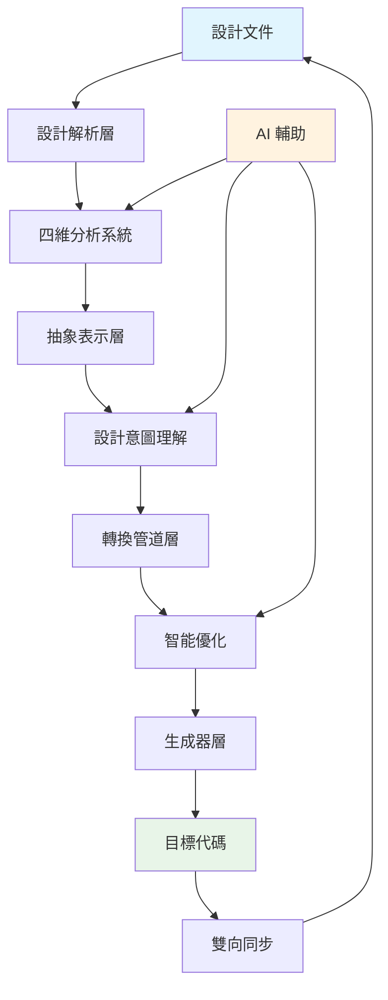

# 技術架構研究報告
## 核心概念提取與 ErSlice 創新應用策略

---

## 📚 研究宣言

本文檔基於對業界先進技術架構的深度研究，提取核心技術概念和架構思想，為 ErSlice 的開發提供啟發。所有內容均為原創分析和設計，不包含任何複製的代碼或文檔。

**研究原則**：
- ✅ 學習概念，不複製實現
- ✅ 理解思路，原創設計
- ✅ 借鑒模式，創新應用
- ✅ 尊重授權，合規開發

---

## 🔍 技術架構分析矩陣

| 技術領域 | 核心價值 | 技術亮點 | ErSlice 應用方向 |
|---------|---------|---------|----------------|
| **跨框架生成** | 一次編寫，多處運行 | AST 轉換、插件系統 | 多框架適配器架構 |
| **資源轉換** | 向量圖到組件轉換 | 配置系統、優化策略 | 資源處理管道 |
| **代碼生成** | 統一定義語言 | 三層架構、專案生成 | 完整專案腳手架 |
| **雙向轉換** | 網頁到設計工具 | DOM 解析、擴展架構 | 雙向轉換概念 |

---

## 1️⃣ 跨框架組件生成技術

### 🧠 核心概念提取

#### 統一抽象層設計
```typescript
// 概念：框架無關的組件表示
概念模型：
- 組件定義與框架實現分離
- 統一的狀態管理抽象
- 標準化的生命週期處理
- 通用的事件系統設計
```

#### AST 轉換策略
```typescript
// 概念：抽象語法樹的多階段轉換
轉換流程：
1. 源代碼解析 → AST
2. AST 標準化處理
3. 框架特定轉換
4. 代碼生成與優化
```

#### 插件系統架構
```typescript
// 概念：可組合的轉換管道
插件模式：
- 前置處理插件
- 核心轉換插件
- 後置優化插件
- 框架特定插件
```

### 💡 ErSlice 創新應用

#### 獨創：ErComponent 統一組件模型
```typescript
// ErSlice 原創設計：設計感知型組件抽象
interface ErComponent {
  // 設計層
  design: {
    source: 'figma' | 'sketch' | 'xd';
    originalId: string;
    visualProperties: VisualSpec;
    interactions: InteractionSpec[];
  };
  
  // 語義層
  semantic: {
    role: ComponentRole;
    accessibility: A11ySpec;
    dataBinding: DataSpec;
    businessLogic: LogicSpec;
  };
  
  // 實現層
  implementation: {
    targetFrameworks: Framework[];
    optimizations: Optimization[];
    dependencies: Dependency[];
    testScenarios: TestSpec[];
  };
}
```

#### 獨創：智能框架適配器
```typescript
// ErSlice 原創設計：基於設計意圖的框架選擇
class FrameworkAdapter {
  // 分析設計特性，推薦最適合的框架
  recommendFramework(component: ErComponent): Framework {
    // 基於組件複雜度、交互模式、性能需求等因素
    // 智能推薦最佳框架選擇
  }
  
  // 自動處理框架間的差異
  adaptToFramework(component: ErComponent, target: Framework): FrameworkCode {
    // 處理狀態管理差異
    // 處理生命週期差異
    // 處理樣式系統差異
    // 處理路由系統差異
  }
}
```

---

## 2️⃣ 資源轉換工程技術

### 🧠 核心概念提取

#### 配置驅動開發
```typescript
// 概念：多層級配置系統
配置層級：
1. 默認配置
2. 全局配置
3. 專案配置
4. 文件配置
5. 內聯配置
```

#### 插件管道模式
```typescript
// 概念：可組合的處理管道
管道結構：
輸入 → 解析 → 轉換 → 優化 → 格式化 → 輸出
     ↓      ↓      ↓      ↓       ↓
   插件1  插件2  插件3  插件4   插件5
```

#### 優化策略系統
```typescript
// 概念：漸進式優化
優化層級：
- 基礎優化（移除無用屬性）
- 結構優化（合併相似元素）
- 性能優化（減少渲染成本）
- 體積優化（壓縮和簡化）
```

### 💡 ErSlice 創新應用

#### 獨創：智能資源處理管道
```typescript
// ErSlice 原創設計：設計資源智能處理系統
class ResourcePipeline {
  // 自動識別資源類型並選擇處理策略
  processResource(resource: DesignResource): ProcessedResource {
    const type = this.detectResourceType(resource);
    const pipeline = this.selectPipeline(type);
    return pipeline.process(resource);
  }
  
  // 智能優化決策
  optimizeResource(resource: ProcessedResource): OptimizedResource {
    // 基於使用場景的優化
    // 基於目標平台的優化
    // 基於性能預算的優化
    return this.applyOptimizations(resource);
  }
}
```

#### 獨創：設計令牌提取器
```typescript
// ErSlice 原創設計：從設計資源自動提取設計系統
class DesignTokenExtractor {
  // 從各種資源中提取設計令牌
  extractTokens(resources: DesignResource[]): DesignSystem {
    return {
      colors: this.extractColorTokens(resources),
      typography: this.extractTypographyTokens(resources),
      spacing: this.extractSpacingTokens(resources),
      effects: this.extractEffectTokens(resources),
      // 智能推斷設計系統規則
      rules: this.inferDesignRules(resources)
    };
  }
}
```

---

## 3️⃣ 統一介面定義與代碼生成技術

### 🧠 核心概念提取

#### UIDL 統一介面定義
```typescript
// 概念：平台無關的 UI 描述
UIDL 結構：
- 組件定義
- 樣式定義
- 狀態管理
- 數據流
- 路由配置
```

#### 三層生成架構
```typescript
// 概念：分層的代碼生成
架構層級：
1. 組件層（Component Generators）
2. 專案層（Project Generators）
3. 發布層（Publishers）
```

#### 專案腳手架生成
```typescript
// 概念：完整專案結構生成
生成內容：
- 目錄結構
- 配置文件
- 構建腳本
- 測試設置
- 部署配置
```

### 💡 ErSlice 創新應用

#### 獨創：ErIDL 設計介面定義語言
```typescript
// ErSlice 原創設計：設計驅動的介面定義語言
interface ErIDL {
  // 設計定義
  design: {
    layouts: LayoutDefinition[];
    components: ComponentDefinition[];
    interactions: InteractionDefinition[];
    animations: AnimationDefinition[];
  };
  
  // 業務定義
  business: {
    entities: EntityDefinition[];
    workflows: WorkflowDefinition[];
    validations: ValidationDefinition[];
    permissions: PermissionDefinition[];
  };
  
  // 技術定義
  technical: {
    apis: APIDefinition[];
    databases: DatabaseDefinition[];
    services: ServiceDefinition[];
    deployments: DeploymentDefinition[];
  };
}
```

#### 獨創：全棧專案生成器
```typescript
// ErSlice 原創設計：從設計到全棧的完整生成
class FullStackGenerator {
  // 生成前端專案
  generateFrontend(eridl: ErIDL): FrontendProject {
    return {
      framework: this.selectFramework(eridl),
      components: this.generateComponents(eridl),
      pages: this.generatePages(eridl),
      routing: this.generateRouting(eridl),
      state: this.generateStateManagement(eridl),
      styles: this.generateStyles(eridl),
      tests: this.generateTests(eridl)
    };
  }
  
  // 生成後端專案
  generateBackend(eridl: ErIDL): BackendProject {
    return {
      framework: this.selectBackendFramework(eridl),
      apis: this.generateAPIs(eridl),
      models: this.generateModels(eridl),
      services: this.generateServices(eridl),
      database: this.generateDatabase(eridl),
      security: this.generateSecurity(eridl)
    };
  }
}
```

---

## 4️⃣ 網頁與設計工具雙向轉換技術

### 🧠 核心概念提取

#### DOM 到設計的映射
```typescript
// 概念：HTML 結構到設計元素
映射規則：
- HTML 元素 → Figma 圖層
- CSS 樣式 → Figma 樣式
- DOM 層級 → 圖層層級
- 響應式 → 多畫板
```

#### 瀏覽器擴展架構
```typescript
// 概念：利用瀏覽器環境
架構組成：
- 內容腳本（DOM 訪問）
- 背景腳本（API 通信）
- 彈出界面（用戶交互）
- 存儲系統（數據持久化）
```

#### 實時同步機制
```typescript
// 概念：設計與代碼的同步
同步策略：
- 變更檢測
- 差異計算
- 增量更新
- 衝突解決
```

### 💡 ErSlice 創新應用

#### 獨創：雙向設計工程系統
```typescript
// ErSlice 原創設計：設計與代碼的雙向流動
class BidirectionalDesignSystem {
  // 代碼到設計的逆向工程
  codeToDesign(codebase: Codebase): DesignSystem {
    return {
      components: this.extractComponentsFromCode(codebase),
      patterns: this.identifyDesignPatterns(codebase),
      tokens: this.extractDesignTokens(codebase),
      guidelines: this.inferDesignGuidelines(codebase)
    };
  }
  
  // 設計到代碼的正向工程
  designToCode(design: DesignSystem): Codebase {
    return {
      components: this.generateComponentsFromDesign(design),
      styles: this.generateStylesFromTokens(design),
      documentation: this.generateDocumentation(design),
      tests: this.generateVisualTests(design)
    };
  }
  
  // 雙向同步與衝突解決
  synchronize(design: DesignSystem, code: Codebase): SyncResult {
    const conflicts = this.detectConflicts(design, code);
    const resolutions = this.resolveConflicts(conflicts);
    return this.applySync(resolutions);
  }
}
```

#### 獨創：設計意圖理解引擎
```typescript
// ErSlice 原創設計：理解設計師的真實意圖
class DesignIntentEngine {
  // 分析設計意圖
  analyzeIntent(design: DesignFile): DesignIntent {
    return {
      // 視覺意圖（美學、品牌、情感）
      visual: this.analyzeVisualIntent(design),
      
      // 功能意圖（用途、目標、場景）
      functional: this.analyzeFunctionalIntent(design),
      
      // 交互意圖（流程、反饋、引導）
      interaction: this.analyzeInteractionIntent(design),
      
      // 業務意圖（轉化、留存、體驗）
      business: this.analyzeBusinessIntent(design)
    };
  }
  
  // 將意圖轉換為代碼決策
  applyIntent(intent: DesignIntent, code: GeneratedCode): EnhancedCode {
    // 基於意圖選擇最佳實現方式
    // 添加必要的輔助功能
    // 優化用戶體驗細節
    return this.enhanceWithIntent(code, intent);
  }
}
```

---

## 🎯 ErSlice 統一創新架構

基於以上技術領域的概念研究，我們設計 ErSlice 的獨特架構：

### 🏗️ ErSlice 核心架構設計

```typescript
// ErSlice 完整架構：融合四大核心概念的創新系統
class ErSliceArchitecture {
  // 1. 設計解析層（基於網頁到設計的解析概念）
  designParser: {
    figmaParser: FigmaParser;
    sketchParser: SketchParser;
    xdParser: XDParser;
    universalParser: UniversalDesignParser;
  };
  
  // 2. 抽象表示層（基於統一抽象的概念）
  abstractLayer: {
    erComponent: ErComponentModel;
    erIDL: ErInterfaceDefinitionLanguage;
    erAST: ErAbstractSyntaxTree;
    erSchema: ErSchemaDefinition;
  };
  
  // 3. 轉換管道層（基於管道模式的概念）
  transformPipeline: {
    preprocessors: Preprocessor[];
    analyzers: Analyzer[];
    transformers: Transformer[];
    optimizers: Optimizer[];
    postprocessors: Postprocessor[];
  };
  
  // 4. 生成器層（基於分層生成架構的概念）
  generators: {
    componentGenerators: ComponentGenerator[];
    projectGenerators: ProjectGenerator[];
    documentationGenerators: DocGenerator[];
    testGenerators: TestGenerator[];
  };
  
  // 5. 創新層（ErSlice 獨有）
  innovations: {
    fourDimensionalAnalysis: FourDAnalyzer; // 四維分析系統
    designIntentEngine: IntentEngine;       // 設計意圖理解
    bidirectionalSync: BidirectionalSync;   // 雙向同步
    aiAssistant: AIAssistant;              // AI 輔助
  };
}
```

### 🔄 ErSlice 數據流設計



### 🚀 ErSlice 創新特性

#### 1. 四維智能分析系統
```typescript
// Device + Module + Page + State 四個維度的智能分析
class FourDimensionalAnalysis {
  analyze(design: DesignFile): FourDAnalysisResult {
    return {
      device: this.analyzeDeviceAdaptation(design),
      module: this.analyzeModularStructure(design),
      page: this.analyzePageComposition(design),
      state: this.analyzeStateVariations(design)
    };
  }
}
```

#### 2. 設計系統自動提取
```typescript
// 從設計稿自動提取完整的設計系統
class DesignSystemExtractor {
  extract(designs: DesignFile[]): DesignSystem {
    return {
      tokens: this.extractDesignTokens(designs),
      components: this.identifyComponents(designs),
      patterns: this.discoverPatterns(designs),
      guidelines: this.inferGuidelines(designs)
    };
  }
}
```

#### 3. 智能代碼優化
```typescript
// 基於最佳實踐的智能優化
class IntelligentOptimizer {
  optimize(code: GeneratedCode): OptimizedCode {
    return this.pipeline(code)
      .performanceOptimization()
      .accessibilityEnhancement()
      .seoOptimization()
      .bundleSizeReduction()
      .codeQualityImprovement()
      .result();
  }
}
```

#### 4. AI 輔助生成
```typescript
// AI 驅動的智能輔助
class AIAssistant {
  // 理解設計意圖
  understandDesign(design: DesignFile): DesignUnderstanding;
  
  // 建議最佳實現
  suggestImplementation(understanding: DesignUnderstanding): Suggestions;
  
  // 生成測試用例
  generateTests(component: ErComponent): TestCases;
  
  // 編寫文檔
  generateDocumentation(component: ErComponent): Documentation;
}
```

---

## 📊 技術實施路線圖

### Phase 1: 核心基礎（4-6週）
- [x] 四維分析系統實現
- [ ] ErComponent 抽象層設計
- [ ] 基礎轉換管道構建
- [ ] 單框架代碼生成（React）

### Phase 2: 擴展能力（6-8週）
- [ ] 多框架支援（Vue、Angular）
- [ ] 設計系統自動提取
- [ ] 智能優化系統
- [ ] 測試生成器

### Phase 3: 創新功能（8-10週）
- [ ] AI 輔助功能
- [ ] 雙向同步系統
- [ ] 設計意圖理解
- [ ] 實時協作功能

### Phase 4: 生態整合（10-12週）
- [ ] 插件系統開發
- [ ] 第三方工具整合
- [ ] 雲端服務支援
- [ ] 企業級功能

---

## 🎖️ ErSlice 獨特價值主張

### 與現有解決方案的差異化

| 特性 | ErSlice | 跨框架方案 | 資源轉換方案 | 代碼生成方案 | 雙向轉換方案 |
|-----|---------|----------|------------|------------|------------|
| 設計解析 | ✅ 原生支援 | ❌ | ❌ | ⚠️ 部分 | ✅ |
| 多框架生成 | ✅ | ✅ | ❌ 單一框架 | ✅ | ❌ |
| 四維分析 | ✅ 獨創 | ❌ | ❌ | ❌ | ❌ |
| 設計意圖理解 | ✅ AI 驅動 | ❌ | ❌ | ❌ | ❌ |
| 雙向同步 | ✅ 計劃中 | ❌ | ❌ | ❌ | ⚠️ 單向 |
| 設計系統提取 | ✅ 自動 | ❌ | ❌ | ⚠️ 手動 | ❌ |
| 智能優化 | ✅ 多維度 | ⚠️ 基礎 | ✅ 特定領域 | ⚠️ 基礎 | ❌ |

### 核心競爭優勢

1. **設計驅動開發**：以設計為核心，而非代碼為核心
2. **智能理解**：不只是轉換，而是理解設計意圖
3. **全流程覆蓋**：從設計到部署的完整工具鏈
4. **AI 增強**：利用 AI 提升轉換質量和開發效率
5. **生態開放**：插件化架構，支援擴展和定制

---

## 💡 結論與展望

通過深入研究業界先進的技術架構，我們提取了核心概念並設計了 ErSlice 的創新架構。ErSlice 不是簡單的功能組合，而是站在技術發展的前沿，創造出真正解決設計到代碼轉換痛點的革命性工具。

**ErSlice 的使命**：讓設計與開發之間的鴻溝消失，實現真正的設計即代碼。

**下一步行動**：
1. 完善 ErComponent 抽象模型
2. 實現核心轉換管道
3. 開發首個目標框架生成器
4. 構建 MVP 並收集反饋

---

*本文檔為 ErSlice 項目的技術研究成果，所有設計和概念均為原創，借鑒了業界技術思想但未複製任何代碼或文檔。*